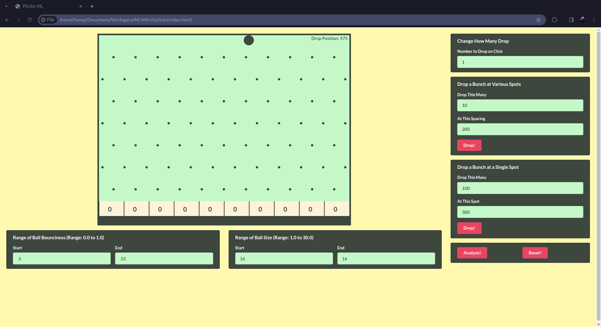

# Plinko ML Playground 🎱 🧠



## Overview 🌟

Welcome to the Plinko ML Playground! This project combines the excitement of a classic Plinko game with the power of machine learning implemented in JavaScript. As I progress, I'll explore different algorithms and approaches to predict the bucket where the ball will fall.

## Plinko Game 🎱

### What is Plinko?

Plinko is a classic game featured on the popular TV show "The Price Is Right." It involves dropping a ball from a designated starting point, allowing it to bounce off pegs and obstacles until it lands in one of several buckets at the bottom.

### How to Play 🎮

1. **Setup:**

   - Adjust ball size, bounciness range using the provided forms.
   - Change the number to drop on click, or choose to drop a bunch at various spots or drop a bunch at a single spot.

2. **Interact:**

   - The ball follows the cursor within the canvas, click on the board to release a ball from the starting point.
   - Watch as the ball bounces unpredictably off pegs and ultimately lands in one of the buckets.

3. **Machine Learning Analysis:**
   - Click the "Analyze" button to run machine learning algorithms and predict the potential bucket where the ball might fall.

## Project Structure 📁

```plaintext
.
|-- css/               # Contains styles for the webpage
|-- js/                # Contains js scripts for the webpage
   |-- game.js         # Game implementation using Matter.js
   |-- main.js         # Contains code to run analysis & ML algos
|-- .eslintrc.json     # ESLint configuration
|-- .prettierrc.json   # Prettier configuration
|-- index.html         # Main webpage
|-- LICENSE            # License used for this repository
|-- preview.png        # Image preview of the webpage
|-- README.md          # Project documentation
```

## Getting Started 🚀

1. Clone the repository
   ```bash
   git clone git@github.com:AmaaelTyrneaMitore/PlinkoMLPlayground.git
   ```
2. Open the `index.html` in your browser  (don't forget to open the browser console 😉)

## Branches 🌳

- The `00-Vanilla_Plinko` branch contains the basic Plinko game using Matter.js
- I will create new branches for every new upgrade, or whenever I will optimize or implement a new approach/algorithm and will merge it to the main branch

## Contributing 🤝

Contributions are welcome! If you have ideas for improvements, feel free to open an issue or create a pull request.

## License 📝

This project is licensed under the [GPL-3.0 License](LICENSE).

Feel free to reach out at [sshashank790@gmail.com](mailto:sshashank790@gmail.com) for any questions or feedback!
